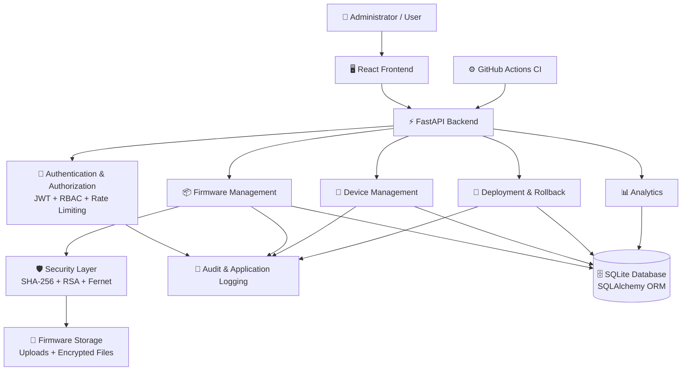
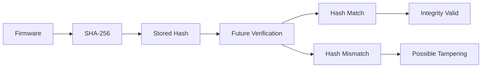
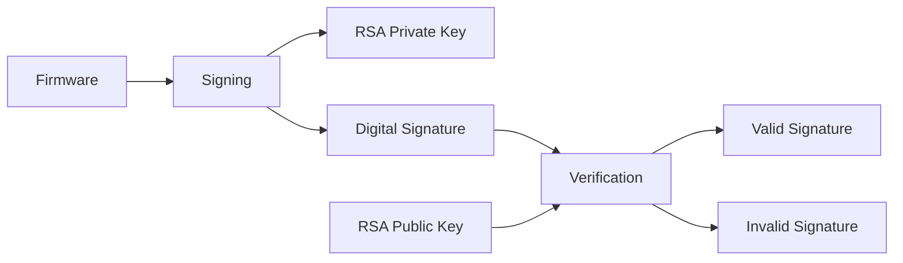
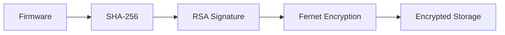
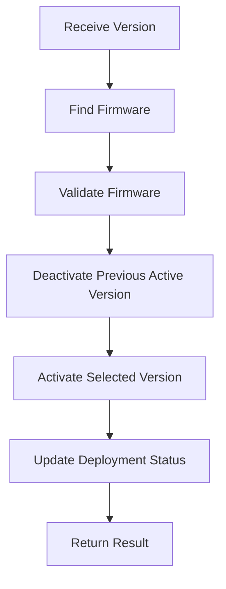
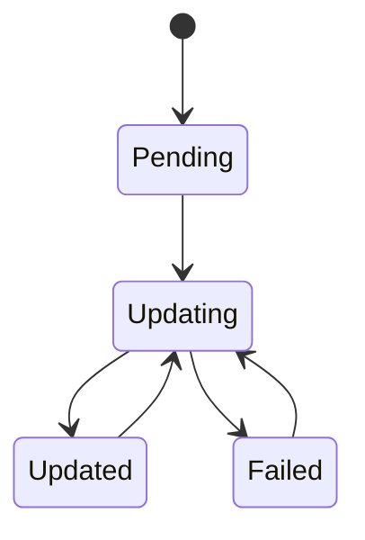
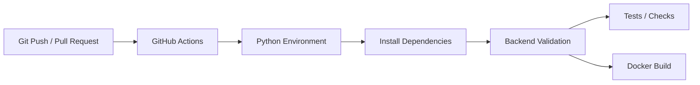
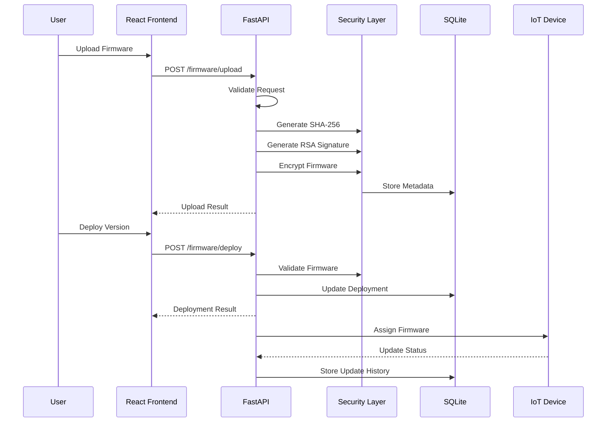

# 🔐 Secure Firmware Update System

### Enterprise-Grade Secure OTA Firmware Update Platform for IoT & Edge Devices

A security-focused firmware update platform designed to securely **upload, verify, sign, encrypt, deploy, monitor, and manage firmware** for IoT and edge devices.

The project combines **FastAPI, React, SQLite, SQLAlchemy, RSA Digital Signatures, SHA-256 Integrity Verification, Fernet Encryption, JWT Authentication, Role-Based Authorization, Rate Limiting, Security Headers, Audit Logging, CI/CD validation, and security testing** into a complete firmware lifecycle.

---

## 📌 Project Overview

Firmware is one of the most security-sensitive components in an IoT ecosystem. If an attacker modifies, replaces, or distributes unauthorized firmware, an entire device or fleet can potentially be compromised.

The Secure Firmware Update System provides a controlled firmware lifecycle with multiple security layers:

```text
                    ┌──────────────────────────┐
                    │       Firmware File      │
                    └────────────┬─────────────┘
                                 │
                                 ▼
                    ┌──────────────────────────┐
                    │    Input Validation      │
                    └────────────┬─────────────┘
                                 │
                                 ▼
                    ┌──────────────────────────┐
                    │      SHA-256 Hash         │
                    │   Integrity Verification │
                    └────────────┬─────────────┘
                                 │
                                 ▼
                    ┌──────────────────────────┐
                    │    RSA Digital Signature │
                    │     Authenticity Check   │
                    └────────────┬─────────────┘
                                 │
                                 ▼
                    ┌──────────────────────────┐
                    │   Fernet Encryption      │
                    │ Confidentiality at Rest  │
                    └────────────┬─────────────┘
                                 │
                                 ▼
                    ┌──────────────────────────┐
                    │     Secure Storage       │
                    └────────────┬─────────────┘
                                 │
                                 ▼
                    ┌──────────────────────────┐
                    │ Authentication & RBAC    │
                    └────────────┬─────────────┘
                                 │
                                 ▼
                    ┌──────────────────────────┐
                    │ Deployment & Rollback    │
                    └────────────┬─────────────┘
                                 │
                                 ▼
                    ┌──────────────────────────┐
                    │ Device Update Tracking   │
                    └────────────┬─────────────┘
                                 │
                                 ▼
                    ┌──────────────────────────┐
                    │ Audit Logs & Analytics   │
                    └──────────────────────────┘
```

---

# ✨ Key Features

## 🔐 Security

* JWT-based authentication
* Role-based authorization
* RSA digital signature generation
* RSA signature verification
* SHA-256 firmware integrity verification
* Fernet symmetric encryption
* Protected cryptographic key handling
* Environment-based configuration
* Login rate limiting
* Input validation
* Security response headers
* Content Security Policy (CSP)
* Global exception handling
* Audit logging
* Structured application logging
* Dependency vulnerability scanning
* Security-focused automated tests

## 📦 Firmware Management

* Firmware upload
* Firmware metadata management
* SHA-256 hash generation
* RSA signing
* RSA signature verification
* Firmware encryption
* Authorized firmware decryption
* Firmware history
* Latest firmware retrieval
* Version management
* Duplicate-version validation
* Firmware deployment
* Firmware rollback

## 📡 Device Management

* IoT device registration
* Device listing
* Device lookup
* Device update
* Device deletion
* Firmware assignment
* Device update-status tracking
* Device history
* Device filtering by status and firmware

## 🚀 Deployment

* Firmware deployment by version
* Active firmware management
* Deployment history
* Deployment status tracking
* Firmware rollback
* Deployment analytics

## 📊 Monitoring & Operations

* Health check API
* Analytics APIs
* Audit logging
* Application logging
* Global exception handling
* Swagger/OpenAPI documentation
* Docker support
* CI/CD validation

---

# 🏗️ System Architecture



---

# 🔄 Secure Firmware Lifecycle


---

# 🛡️ Security Architecture

The project uses a layered security model instead of depending on a single security mechanism.

```text
                    ┌─────────────────────┐
                    │    API Request      │
                    └──────────┬──────────┘
                               │
                               ▼
                    ┌─────────────────────┐
                    │   Rate Limiting     │
                    └──────────┬──────────┘
                               │
                               ▼
                    ┌─────────────────────┐
                    │ Input Validation    │
                    └──────────┬──────────┘
                               │
                               ▼
                    ┌─────────────────────┐
                    │ JWT Authentication  │
                    └──────────┬──────────┘
                               │
                               ▼
                    ┌─────────────────────┐
                    │ Role Authorization  │
                    └──────────┬──────────┘
                               │
                               ▼
                    ┌─────────────────────┐
                    │ Business Logic      │
                    └──────────┬──────────┘
                               │
                               ▼
              ┌──────────────────────────────────┐
              │ Firmware Security Controls       │
              │                                  │
              │ SHA-256 → Integrity              │
              │ RSA      → Authenticity          │
              │ Fernet   → Confidentiality       │
              └────────────────┬─────────────────┘
                               │
                               ▼
                    ┌─────────────────────┐
                    │ Audit / Logging     │
                    └─────────────────────┘
```

---

# 🔑 Authentication & Authorization

Authentication is implemented using JWT bearer tokens.

### Login

```http
POST /login
```

Example request:

```json
{
  "username": "admin",
  "password": "admin123"
}
```

Successful authentication returns an access token.

```json
{
  "access_token": "<JWT_TOKEN>",
  "token_type": "bearer",
  "role": "admin"
}
```

Use the token in Swagger:

```text
Authorization: Bearer <JWT_TOKEN>
```

### Authorization Model

The application supports role-based access control.

```text
Admin
 ├── Firmware Management
 ├── Firmware Deployment
 ├── Firmware Rollback
 ├── Device Management
 └── Authorized Administrative Operations

User
 └── Authorized Firmware Access
```

Authorization behavior should always be verified against the currently implemented API and role configuration.

---

# 🔏 SHA-256 Integrity Verification

SHA-256 is used to generate a deterministic hash of firmware content.



The integrity process helps detect unauthorized modification of firmware content.

---

# ✍️ RSA Digital Signatures

RSA digital signatures are used to verify firmware authenticity.



### Security Benefits

* Detects unauthorized firmware modification
* Verifies firmware authenticity
* Supports trusted firmware validation
* Separates signing and verification capabilities

### Important Security Rule

Private cryptographic keys must **never be committed to Git**.

Recommended ignored files include:

```text
.env
private_key.pem
aes.key
*.bundle
```

---

# 🔒 Firmware Encryption

Firmware files can be protected using Fernet symmetric encryption.



### Decryption Flow

```text
Authorized Request
       │
       ▼
Encrypted Firmware
       │
       ▼
Fernet Decryption
       │
       ▼
Decrypted Firmware
```

Encryption protects firmware confidentiality while SHA-256 and RSA provide integrity and authenticity controls.

---

# 📦 Firmware Management APIs

The firmware router currently provides functionality including:

| Method | Endpoint                     | Purpose                   |
| ------ | ---------------------------- | ------------------------- |
| POST   | `/firmware/upload`           | Upload firmware           |
| POST   | `/firmware/verify`           | Verify firmware           |
| POST   | `/firmware/verify-signature` | Verify RSA signature      |
| POST   | `/firmware/decrypt`          | Decrypt firmware          |
| GET    | `/firmware/latest`           | Retrieve latest firmware  |
| GET    | `/firmware/history`          | Retrieve firmware history |
| POST   | `/firmware/deploy`           | Deploy firmware           |
| POST   | `/firmware/rollback`         | Roll back firmware        |

---

# 🚀 Firmware Deployment

Deployment is version based.

### Endpoint

```http
POST /firmware/deploy
```

Example request:

```json
{
  "version": "1.0.0"
}
```

Example response:

```json
{
  "message": "Firmware deployed successfully",
  "active_version": "1.0.0"
}
```

### Deployment Workflow



---

# 🔄 Firmware Rollback

Rollback provides a controlled way to move away from a currently deployed firmware version.

```text
Current Firmware
       │
       ▼
Deployment History
       │
       ▼
Select Previous Version
       │
       ▼
Validate Version
       │
       ▼
Rollback
       │
       ▼
Update Deployment Status
```

Endpoint:

```http
POST /firmware/rollback
```

---

# 📡 Device Management

Device management supports IoT and edge device lifecycle operations.

| Method | Endpoint                                 | Purpose              |
| ------ | ---------------------------------------- | -------------------- |
| POST   | `/devices/register`                      | Register device      |
| GET    | `/devices`                               | List devices         |
| GET    | `/devices/{device_id}`                   | Get device           |
| PUT    | `/devices/{device_id}`                   | Update device        |
| DELETE | `/devices/{device_id}`                   | Delete device        |
| POST   | `/devices/assign-firmware`               | Assign firmware      |
| POST   | `/devices/update-status`                 | Update device status |
| GET    | `/devices/search/serial/{serial_number}` | Search by serial     |
| GET    | `/devices/status/{status}`               | Filter by status     |
| GET    | `/devices/firmware/{version}`            | Filter by firmware   |
| GET    | `/devices/history`                       | Device history       |

### Device Lifecycle



---

# 🚀 Deployment Management

Deployment APIs provide deployment tracking and rollback operations.

| Method | Endpoint                      | Purpose                  |
| ------ | ----------------------------- | ------------------------ |
| POST   | `/deployment/deploy`          | Start deployment         |
| GET    | `/deployment/history`         | Deployment history       |
| GET    | `/deployment/status`          | Deployment status        |
| GET    | `/deployment/status/{status}` | Filter deployment status |
| POST   | `/deployment/rollback`        | Rollback deployment      |

---

# 📊 Analytics

Analytics APIs provide operational visibility into the firmware deployment environment.

| Method | Endpoint                           | Purpose               |
| ------ | ---------------------------------- | --------------------- |
| GET    | `/analytics/deployment-stats`      | Deployment statistics |
| GET    | `/analytics/firmware-distribution` | Firmware distribution |

---

# ❤️ Health Check

The health endpoint provides a basic application and database health check.

```http
GET /health
```

Example:

```json
{
  "status": "healthy"
}
```

Use this endpoint to verify that the backend is running before performing frontend integration or API testing.

---

# 📜 Audit Logging

Security-sensitive actions are recorded through the audit logging layer.

Examples include:

* Successful login
* Failed login
* Firmware operations
* Security-sensitive actions
* Authentication events
* Validation failures
* Application events

The project also uses structured application logging for:

```text
Application Startup
       ↓
Database Initialization
       ↓
API Activity
       ↓
Authentication Events
       ↓
Validation Errors
       ↓
Exceptions
       ↓
Security Events
```

---

# 🛡️ Security Headers

The backend applies security response headers including:

```text
X-Content-Type-Options: nosniff
X-Frame-Options: DENY
Referrer-Policy: strict-origin-when-cross-origin
Content-Security-Policy
```

The Swagger documentation endpoint requires controlled CSP permissions for its required external assets.

The `/docs` endpoint therefore uses a Swagger-specific CSP policy while normal application responses maintain a more restrictive policy.

---

# 🚦 Rate Limiting

Authentication endpoints are protected using request rate limiting to reduce repeated login attempts.

The project includes automated security testing for rate limiting behavior.

---

# 🧪 Security Testing

The backend contains tests covering security-sensitive behavior.

### Security Tests

```text
backend/tests/security/
├── test_authentication.py
├── test_authorization.py
├── test_input_validation.py
├── test_rate_limiting.py
└── test_security_headers.py
```

### Application Tests

```text
backend/tests/
├── test_deployment.py
├── test_device.py
├── test_firmware.py
├── test_health.py
└── test_login.py
```

Run the test suite:

```bash
pytest
```

---

# 🔍 Dependency & Security Scanning

The project uses security scanning tools such as:

### pip-audit

```bash
pip-audit
```

### Trivy

```bash
trivy fs --scanners vuln --skip-dirs venv --skip-dirs .git .
```

These checks help identify vulnerable dependencies and insecure project artifacts.

---

# ⚙️ Environment Configuration

Sensitive configuration should be supplied through environment variables.

Example:

```env
DATABASE_URL=sqlite:///firmware.db
SECRET_KEY=CHANGE_ME_TO_A_LONG_RANDOM_SECRET
ALGORITHM=HS256
ACCESS_TOKEN_EXPIRE_MINUTES=30
```

Template files:

```text
.env.example
backend/.env.example
frontend/.env.example
```

### Never commit

```text
.env
private_key.pem
aes.key
*.bundle
local database files containing sensitive data
node_modules/
```

Always verify Git tracking before pushing:

```powershell
git ls-files | Select-String "\.env$"
git ls-files | Select-String "private_key|aes\.key|\.bundle"
git ls-files | Select-String "node_modules"
```

---

# 🛠️ Installation

## Prerequisites

* Python 3.10+
* Node.js
* npm
* Git
* SQLite
* Optional: Docker
* Optional: Trivy
* Optional: pip-audit

---

# 🐍 Backend Setup

From the project root:

```powershell
cd backend
```

Create/activate the virtual environment:

```powershell
python -m venv ..\venv
..\venv\Scripts\activate
```

Install dependencies:

```powershell
pip install -r requirements.txt
```

Set a development secret:

```powershell
$env:SECRET_KEY="change-this-local-development-secret"
```

Start the backend:

```powershell
uvicorn main:app --reload --port 8001
```

Backend:

```text
http://127.0.0.1:8001
```

---

# 📖 Swagger / OpenAPI Documentation

Swagger UI:

```text
http://127.0.0.1:8001/docs
```

OpenAPI specification:

```text
http://127.0.0.1:8001/openapi.json
```

Swagger can be used to:

* Authenticate users
* Authorize using JWT
* Upload firmware
* Verify firmware
* Verify RSA signatures
* Decrypt firmware
* Manage devices
* Deploy firmware
* Roll back firmware
* Inspect API responses
* Test validation behavior
* Test protected endpoints

---

# ⚛️ Frontend Setup

From the project root:

```powershell
cd frontend
npm install
npm run dev
```

The React frontend communicates with the FastAPI backend through a configurable API base URL.

The frontend integration uses:

```env
VITE_API_BASE_URL=<backend-url>
```

The backend URL should not be hardcoded into frontend source code.

---

# 🔗 Frontend API Integration

The frontend API layer provides centralized communication with the backend.

The integration supports:

* Centralized API client
* Configurable backend URL
* JWT bearer token handling
* Protected routes
* Authentication/session handling
* 401 Unauthorized handling
* 403 Forbidden handling
* 404 Not Found handling
* 422 Validation handling
* 429 Rate Limit handling
* 5xx server error handling
* Network/backend connection error handling

This keeps frontend API communication consistent across the application.

---

# 🐳 Docker

Build the backend image:

```bash
docker build -t secure-firmware-api .
```

Run:

```bash
docker run -p 8001:8001 secure-firmware-api
```

If Docker Compose configuration is available:

```bash
docker compose up --build
```

---

# ⚙️ CI/CD

The project includes GitHub Actions-based continuous integration.



The CI workflow helps detect:

* Dependency installation problems
* Backend build issues
* Test failures
* Integration issues
* Docker build problems

---

# 📁 Project Structure

```text
Secure-Firmware-Update-System/
│
├── backend/
│   ├── app/
│   ├── database/
│   ├── models/
│   ├── routers/
│   │   ├── firmware.py
│   │   ├── device.py
│   │   ├── deployment.py
│   │   └── analytics.py
│   │
│   ├── tests/
│   │   ├── security/
│   │   ├── test_deployment.py
│   │   ├── test_device.py
│   │   ├── test_firmware.py
│   │   ├── test_health.py
│   │   └── test_login.py
│   │
│   ├── utils/
│   │   ├── aes_utils.py
│   │   ├── audit_logger.py
│   │   ├── auth_utils.py
│   │   ├── encryption_utils.py
│   │   ├── hash_utils.py
│   │   └── rsa_utils.py
│   │
│   ├── config.py
│   ├── database/
│   ├── logging_config.py
│   ├── main.py
│   ├── models/
│   ├── requirements.txt
│   ├── Dockerfile
│   ├── docker-compose.yml
│   └── render.yaml
│
├── frontend/
│   ├── src/
│   ├── services/
│   ├── pages/
│   ├── styles/
│   └── package.json
│
├── docs/
│   ├── API_Documentation.md
│   ├── Architecture.md
│   ├── Installation_Guide.md
│   ├── Project_Overview.md
│   ├── User_Guide.md
│   ├── ci-cd.md
│   ├── firmware-upload-workflow.md
│   └── rsa-digital-signature-workflow.md
│
├── .github/
│   └── workflows/
│       └── ci.yml
│
├── .env.example
├── .gitignore
└── README.md
```

---

# 🗄️ Database Design

The backend uses:

* SQLite
* SQLAlchemy ORM

Core entities include:

```text
Firmware
   │
   ├── Version
   ├── Hash
   ├── Signature
   └── Deployment Information

Device
   │
   ├── Device Information
   ├── Assigned Firmware
   └── Update Status

UpdateHistory
   │
   ├── Firmware Version
   ├── Device
   └── Update Information
```

---

# 🔄 End-to-End Firmware Workflow



---

# 📈 Project Security Layers

| Security Control    | Purpose                    |
| ------------------- | -------------------------- |
| JWT                 | Authentication             |
| RBAC                | Authorization              |
| Rate Limiting       | Brute-force protection     |
| Input Validation    | Invalid request protection |
| SHA-256             | Integrity verification     |
| RSA Signature       | Authenticity verification  |
| Fernet              | Firmware confidentiality   |
| CSP                 | Browser-side security      |
| Security Headers    | HTTP hardening             |
| Audit Logging       | Security traceability      |
| Application Logging | Operational visibility     |
| pip-audit           | Python dependency scanning |
| Trivy               | Vulnerability scanning     |
| CI                  | Automated validation       |

---

# 🧰 Technology Stack

| Layer               | Technology             |
| ------------------- | ---------------------- |
| Frontend            | React                  |
| Backend             | FastAPI                |
| Language            | Python                 |
| Database            | SQLite                 |
| ORM                 | SQLAlchemy             |
| Authentication      | JWT                    |
| Cryptography        | RSA / SHA-256 / Fernet |
| API Documentation   | Swagger / OpenAPI      |
| Frontend API Client | Axios                  |
| Containerization    | Docker                 |
| CI/CD               | GitHub Actions         |
| Security Scanning   | pip-audit / Trivy      |
| Version Control     | Git / GitHub           |

---

# 👥 Team

| Member             | Responsibility                                          |
| ------------------ | ------------------------------------------------------- |
| **Prasad Kedar**   | Team Lead, Backend, Security, Architecture, Integration |
| **Al Ameen Ayoob** | Frontend Development & API Integration                  |
| **Adarsh**         | Testing & QA                                            |
| **Nelna K Siyad**  | Documentation & Testing                                 |

---

# 🎯 Project Objectives

The primary objectives of this project are:

1. Provide a secure firmware update mechanism.
2. Verify firmware integrity before deployment.
3. Verify firmware authenticity using digital signatures.
4. Protect stored firmware using encryption.
5. Authenticate and authorize API users.
6. Manage firmware versions and rollback.
7. Track IoT device update status.
8. Maintain audit and operational logs.
9. Provide API and frontend integration.
10. Apply security testing and CI validation.

---

# 🧪 Recommended Verification Flow

For a complete project demonstration:

```text
1. Start Backend
       ↓
2. Open Swagger
       ↓
3. Check /health
       ↓
4. Login
       ↓
5. Authorize JWT
       ↓
6. Upload Firmware
       ↓
7. Verify SHA-256
       ↓
8. Verify RSA Signature
       ↓
9. Check Firmware History
       ↓
10. Deploy Firmware
       ↓
11. Register Device
       ↓
12. Assign Firmware
       ↓
13. Update Device Status
       ↓
14. Check Deployment / Analytics
       ↓
15. Test Rollback
       ↓
16. Review Audit / Application Logs
```

---

# 🖥️ Demo Screens Recommended

For an internship/project presentation, the following screens provide strong evidence:

### Backend

* Swagger `/docs`
* `/health` response
* Login API response
* JWT authorization
* Firmware upload response
* Firmware verification response
* RSA signature verification response
* Firmware history
* Latest firmware
* Deployment response
* Rollback response
* Device registration
* Device history
* Analytics response

### Frontend

* Login page
* Dashboard
* Firmware upload page
* Firmware history
* Device management
* Deployment page
* API integration page

---

# 🔐 Security Notes

This project is intended as an educational/internship security engineering project and should be hardened further before use in a real production IoT fleet.

Before production deployment, review:

* Cryptographic key storage
* Secret management
* Database security
* TLS/HTTPS
* Device identity and certificate management
* Secure boot
* Hardware-backed key storage
* Firmware signing infrastructure
* Key rotation
* Production logging and monitoring
* Access-control policies
* Backup and recovery
* Deployment approval workflows

---

# 🚧 Future Enhancements

Possible future improvements include:

* Hardware-backed device identity
* Secure Boot integration
* TPM/HSM-backed signing keys
* Certificate-based device authentication
* Multi-factor authentication
* Redis-based distributed rate limiting
* PostgreSQL production database
* Object storage for firmware artifacts
* Firmware release approval workflow
* Canary firmware deployment
* Device fleet management
* Real-time deployment monitoring
* Prometheus/Grafana monitoring
* Centralized SIEM integration
* Automated firmware vulnerability scanning

---

# 📚 Documentation

Additional project documentation is available under:

```text
docs/
```

Important documents include:

* `API_Documentation.md`
* `Architecture.md`
* `Installation_Guide.md`
* `Project_Overview.md`
* `User_Guide.md`
* `ci-cd.md`
* `firmware-upload-workflow.md`
* `rsa-digital-signature-workflow.md`
* `signature-verification-test-cases.md`

---

# 📝 Project Status

### Current Implementation

* ✅ FastAPI backend
* ✅ React frontend
* ✅ SQLite database
* ✅ SQLAlchemy ORM
* ✅ JWT authentication
* ✅ Role-based authorization
* ✅ Firmware upload
* ✅ SHA-256 integrity verification
* ✅ RSA digital signatures
* ✅ Fernet firmware encryption
* ✅ Firmware version management
* ✅ Firmware deployment
* ✅ Firmware rollback
* ✅ Device management
* ✅ Analytics APIs
* ✅ Audit logging
* ✅ Application logging
* ✅ Health check
* ✅ Rate limiting
* ✅ Security headers
* ✅ CSP configuration
* ✅ Security tests
* ✅ Dependency security scanning
* ✅ Docker support
* ✅ GitHub Actions CI
* ✅ Frontend API integration
* ✅ Production frontend CORS configuration

---

# 📄 License

This project was developed as an internship/academic cybersecurity project.

Refer to the repository license file, if present, for the applicable licensing terms.

---

# ⭐ Project Summary

**Secure Firmware Update System** provides a complete security-focused firmware lifecycle for IoT and edge environments.

```text
                SECURE FIRMWARE LIFECYCLE

        ┌───────────────┐
        │ Firmware      │
        │ Upload        │
        └───────┬───────┘
                ↓
        ┌───────────────┐
        │ Validation    │
        └───────┬───────┘
                ↓
        ┌───────────────┐
        │ SHA-256       │
        │ Integrity     │
        └───────┬───────┘
                ↓
        ┌───────────────┐
        │ RSA Signature │
        │ Authenticity  │
        └───────┬───────┘
                ↓
        ┌───────────────┐
        │ Fernet        │
        │ Encryption    │
        └───────┬───────┘
                ↓
        ┌───────────────┐
        │ Secure        │
        │ Storage       │
        └───────┬───────┘
                ↓
        ┌───────────────┐
        │ Deployment    │
        └───────┬───────┘
                ↓
        ┌───────────────┐
        │ Device Update │
        └───────┬───────┘
                ↓
        ┌───────────────┐
        │ Audit &       │
        │ Analytics     │
        └───────────────┘
```

**Secure firmware. Verified updates. Controlled deployment. Protected devices.**
